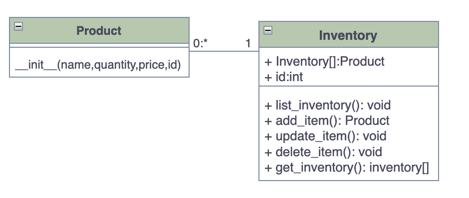
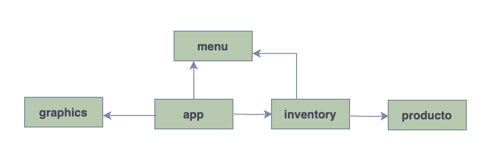
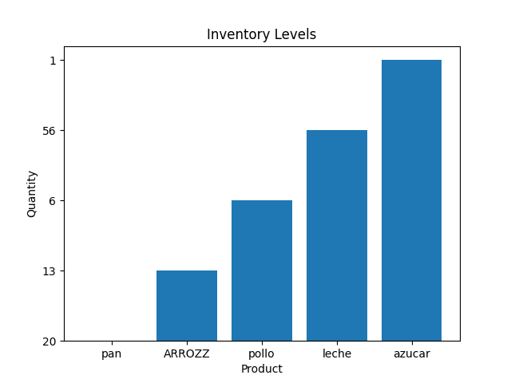
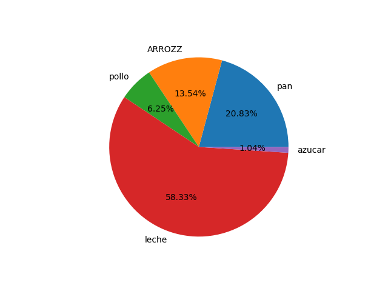
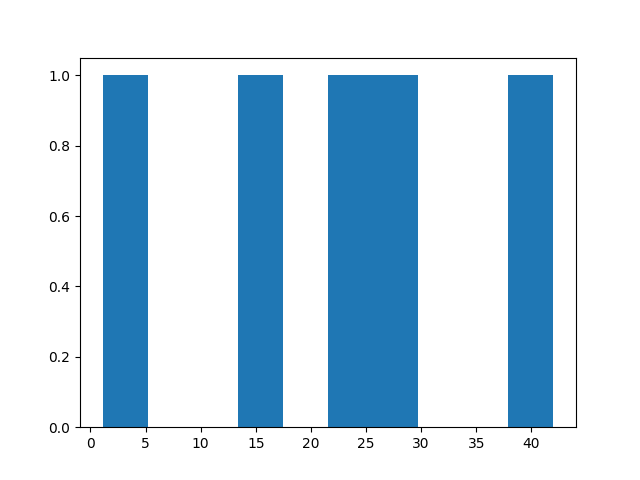
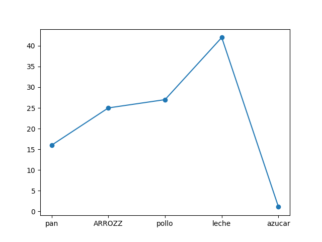

# Diagrama de clases
## Modelado de las clases Product e Inventory. 
- Cada clase incluye sus métodos y atributos.
- Multiplicidad.
    - 1 Product, estará como máximo en un Inventary
    - 1 Inventary podrá 0 Products o muchos Products

 
#

## Modelado de comunicación entre módulos.
Los módulos incluyen funcionalidades que serán importadas en otros módulos. 

 

## Agregando un nuevo procto

```bash
 ~/task4$ python app.py                                   

Select a number from the menu
 1: List product 
 2: Add product 
 3: Update producto 
 4: Delete product 
 5: Graficar metricas
 6: exit menu 
Select an option: 2

New Producto:
 - Product name "String": pan
 - Quantity "Natural" [0-1000]: 20
 - Price "Decimal" [1.0 - 1000.0]: 16
Product: id:0, name:pan, quantity 20, price :16.0

Select a number from the menu
 1: List product 
 2: Add product 
 3: Update producto 
 4: Delete product 
 5: Graficar metricas
 6: exit menu 
Select an option: 2

New Producto:
 - Product name "String": arroz
 - Quantity "Natural" [0-1000]: 13
 - Price "Decimal" [1.0 - 1000.0]: 25
Product: id:1, name:arroz, quantity 13, price :25.0

Select a number from the menu
 1: List product 
 2: Add product 
 3: Update producto 
 4: Delete product 
 5: Graficar metricas
 6: exit menu 
Select an option: 2

New Producto:
 - Product name "String": pollo
 - Quantity "Natural" [0-1000]: 6
 - Price "Decimal" [1.0 - 1000.0]: 27
Product: id:2, name:pollo, quantity 6, price :27.0

Select a number from the menu
 1: List product 
 2: Add product 
 3: Update producto 
 4: Delete product 
 5: Graficar metricas
 6: exit menu 
Select an option: 2

New Producto:
 - Product name "String": leche
 - Quantity "Natural" [0-1000]: 56
 - Price "Decimal" [1.0 - 1000.0]: 42
Product: id:3, name:leche, quantity 56, price :42.0

Select a number from the menu
 1: List product 
 2: Add product 
 3: Update producto 
 4: Delete product 
 5: Graficar metricas
 6: exit menu 
Select an option: 2

New Producto:
 - Product name "String": azucar
 - Quantity "Natural" [0-1000]: 1
 - Price "Decimal" [1.0 - 1000.0]: 1.1
Product: id:4, name:azucar, quantity 1, price :1.1

Select a number from the menu
 1: List product 
 2: Add product 
 3: Update producto 
 4: Delete product 
 5: Graficar metricas
 6: exit menu 
Select an option: 
```
## Listando productos creados
```bash
Select a number from the menu
 1: List product 
 2: Add product 
 3: Update producto 
 4: Delete product 
 5: Graficar metricas
 6: exit menu 
Select an option: 1


List of existing items
[ 0 , pan , 20 , 16.0 ]
[ 1 , arroz , 13 , 25.0 ]
[ 2 , pollo , 6 , 27.0 ]
[ 3 , leche , 56 , 42.0 ]
[ 4 , azucar , 1 , 1.1 ]
Products quantity: 5
```
## Actualizando datos de un producto
```bash
Select a number from the menu
 1: List product 
 2: Add product 
 3: Update producto 
 4: Delete product 
 5: Graficar metricas
 6: exit menu 
Select an option: 3


List of existing items
[ 0 , pan , 20 , 16.0 ]
[ 1 , arroz , 13 , 25.0 ]
[ 2 , pollo , 6 , 27.0 ]
[ 3 , leche , 56 , 42.0 ]
[ 4 , azucar , 1 , 1.1 ]
Products quantity: 5

Write the ID of item to select : 1

Choose an option and enter a new number
1: new_name, 2: new_quantity,3: new_price
Enter the option: 1
 - Product name "String": ARROZZ

List of existing items
[ 0 , pan , 20 , 16.0 ]
[ 1 , ARROZZ , 13 , 25.0 ]
[ 2 , pollo , 6 , 27.0 ]
[ 3 , leche , 56 , 42.0 ]
[ 4 , azucar , 1 , 1.1 ]
Products quantity: 5
```
## Eliminando producto del inventario
```bash
Select a number from the menu
 1: List product 
 2: Add product 
 3: Update producto 
 4: Delete product 
 5: Graficar metricas
 6: exit menu 
Select an option: 4


List of existing items
[ 0 , pan , 20 , 16.0 ]
[ 1 , ARROZZ , 13 , 25.0 ]
[ 2 , pollo , 6 , 27.0 ]
[ 3 , leche , 56 , 42.0 ]
[ 4 , azucar , 1 , 1.1 ]
Products quantity: 5

Write the ID of item to select : 1
Product: id:1, name:ARROZZ, quantity 13, price :25.0
the item Product: id:1, name:ARROZZ, quantity 13, price :25.0 was removed

List of existing items
[ 0 , pan , 20 , 16.0 ]
[ 2 , pollo , 6 , 27.0 ]
[ 3 , leche , 56 , 42.0 ]
[ 4 , azucar , 1 , 1.1 ]
Products quantity: 4
```

## Graficando las entradas
```bash
Select a number from the menu
 1: List product 
 2: Add product 
 3: Update producto 
 4: Delete product 
 5: Graficar metricas
 6: exit menu 
Select an option: 5
```
## Diagrama de barra
 
## Diagrama de torta
 
## Histograma
 
## Diagrama de Disperción
 
